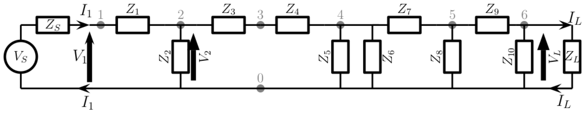

# Circuit Analysis Tool 

This program analyses **cascade circuits**, with any number of **series and parallel impedances** between a **source and a load**. 



## Usage:

```python3 CircuitAnalysisTool.py input.net output.csv```

Replace input.net with the name of your input file, and output.net with the name of your output file. 

## Input File Format:

The input file describes the circuit to be analysed in **3** blocks:
1. **CIRCUIT block**:
    - Between \<CIRCUIT> and \</CIRCUIT> tags
    - Defines components in the circuit, and how they are connected
    - Each component is defined by two node numbers (one for each end of the component), and then its resistance (R), conductance (G), inductance (L) or capacitance (C)
    <br>

    ```
    <CIRCUIT>
    n1=1 n2=2 R=8.55
    n1=2 n2=0 R=141.9
    n1=2 n2=3 R=8.55
    n1=3 n2=4 L=1.59e-3
    n1=4 n2=0 C=3.18e-9
    n1=4 n2=0 L=7.96e-6
    n1=4 n2=5 C=6.37e-7
    n1=5 n2=0 R=150.5
    n1=6 n2=0 R=150.5
    n1=5 n2=6 G=0.02677
    # components do not have to follow their order in the circuit
    </CIRCUIT>
    ```


2. **TERMS block**:
    - Between \<TERMS> and \</TERMS> tags
    - Defines the source and the load, and the frequency range for analysis
    - The source is implicitly connected between node 0 (which is common/ground) and node 1 
    - The source may be give as a Thevenin source or a Norton source
    - The load is connected between node 0 and the last node specified in the CIRCUIT block
    <br>

    ```
    <TERMS>
    # A 5V Thevenin voltage source with RS=50 ohms connected
    # between node 1 and node 0 (common)
    VT=5 RS=50
    # A 2.5 Amp Norton current source with RS=25 Ohms
    #IN=2.5 RS=25
    # Load connected between last node (6 in this case) and node 0 (common)
    RL=75
    # Frequency range and number of frequencies to calculate outputs 
    Fstart=10.0 Fend=10e+6 Nfreqs=10
    </TERMS>
    ```

3. **OUTPUT block**
    - Between \<OUTPUT> and \</OUTPUT> tags
    - Defines the output filename, the outputs to be calculated, and the units to be used for said outputs
    - The outputs can be: 
        - Vin - Input Voltage
        - Iin - Input Current
        - Pin - Input Power
        - Zin - Input Impedance
        - Vout - Output Voltage
        - Iout - Output Current
        - Pout - Output Power
        - Zout - Output Impedance
        - Av - Voltage Gain
        - Ai - Current Gain
    - Input values are measured between nodes 0 and 1, and output values are measured between node 0 and the last node defined in the CIRCUIT block. 
    <br>

    ```
    <OUTPUT>
    Vin V
    Vout V
    Iin A
    Iout A
    Pin W
    Zout Ohms
    Pout W
    Zin Ohms
    Av 
    Ai
    </OUTPUT>
    ```

Further examples can be found in the *Example_Inputs* folder.

## Output File Format:
The output is formatted as a .csv file. The top row is the variable type, the next is the units, and the third and subsequent lines are the output values.

Apart from the frequency, all output values are complex numbers. 

An example output is shown below:

```
      Freq,    Re(Vin),    Im(Vin),   Re(Vout),   Im(Vout),    Re(Iin),    Im(Iin),   Re(Iout),   Im(Iout),    Re(Pin),    Im(Pin),   Re(Zout),   Im(Zout),   Re(Pout),   Im(Pout),    Re(Zin),    Im(Zin),     Re(Av),     Im(Av),     Re(Ai),     Im(Ai)
        Hz,          V,          V,          V,          V,          A,          A,          A,          A,          W,          W,       Ohms,       Ohms,          W,          W,       Ohms,       Ohms,          L,          L,          L,          L
 1.000e+01,  1.247e+00,  5.032e-03, -4.470e-08,  2.328e-10,  7.506e-02, -1.006e-04, -6.985e-10,  2.728e-12,  9.360e-02,  5.032e-04,  8.356e+01, -1.794e-01,  2.685e-17,  9.843e-36,  1.661e+01,  8.932e-02, -3.598e-08,  2.971e-10, -7.971e-09,  2.296e-11,
 1.111e+06,  3.753e+00,  1.130e-02, -2.138e-03, -9.601e-03,  2.495e-02, -2.260e-04, -2.850e-05, -1.280e-04,  9.361e-02,  1.130e-03,  7.789e+01, -1.648e+01,  1.290e-06, -2.822e-23,  1.504e+02,  1.815e+00, -5.773e-04, -2.557e-03, -1.096e-03, -5.142e-03,
 2.222e+06,  3.753e+00,  5.649e-03, -2.041e-03, -1.054e-03,  2.494e-02, -1.130e-04, -2.721e-05, -1.405e-05,  9.361e-02,  5.649e-04,  3.548e+01, -1.634e+01,  7.035e-08,  5.863e-25,  1.504e+02,  9.078e-01, -5.443e-04, -2.800e-04, -1.088e-03, -5.682e-04,
 3.333e+06,  3.753e+00,  3.764e-03, -9.215e-04, -2.779e-04,  2.494e-02, -7.528e-05, -1.229e-05, -3.705e-06,  9.361e-02,  3.764e-04,  3.196e+01, -1.024e+01,  1.235e-08,  1.037e-25,  1.504e+02,  6.049e-01, -2.456e-04, -7.380e-05, -4.921e-04, -1.500e-04,
 4.444e+06,  3.753e+00,  2.822e-03, -5.175e-04, -1.122e-04,  2.494e-02, -5.645e-05, -6.899e-06, -1.496e-06,  9.361e-02,  2.822e-04,  3.100e+01, -7.499e+00,  3.738e-09,  1.125e-25,  1.504e+02,  4.536e-01, -1.379e-04, -2.979e-05, -2.765e-04, -6.058e-05,
 5.556e+06,  3.753e+00,  2.258e-03, -3.306e-04, -5.624e-05,  2.494e-02, -4.515e-05, -4.407e-06, -7.499e-07,  9.361e-02,  2.258e-04,  3.059e+01, -5.931e+00,  1.499e-09,  1.328e-26,  1.504e+02,  3.629e-01, -8.809e-05, -1.493e-05, -1.766e-04, -3.038e-05,
 6.667e+06,  3.753e+00,  1.881e-03, -2.293e-04, -3.218e-05,  2.494e-02, -3.763e-05, -3.057e-06, -4.291e-07,  9.361e-02,  1.881e-04,  3.038e+01, -4.912e+00,  7.147e-10,  1.516e-27,  1.504e+02,  3.024e-01, -6.110e-05, -8.544e-06, -1.225e-04, -1.739e-05,
 7.778e+06,  3.753e+00,  1.612e-03, -1.683e-04, -2.012e-05,  2.494e-02, -3.225e-05, -2.244e-06, -2.683e-07,  9.361e-02,  1.612e-04,  3.026e+01, -4.195e+00,  3.831e-10,  8.158e-27,  1.504e+02,  2.592e-01, -4.485e-05, -5.343e-06, -8.995e-05, -1.087e-05,
 8.889e+06,  3.753e+00,  1.411e-03, -1.288e-04, -1.342e-05,  2.494e-02, -2.822e-05, -1.717e-06, -1.789e-07,  9.361e-02,  1.411e-04,  3.018e+01, -3.661e+00,  2.235e-10,  1.377e-27,  1.504e+02,  2.268e-01, -3.432e-05, -3.563e-06, -6.883e-05, -7.252e-06,
 1.000e+07,  3.753e+00,  1.254e-03, -1.017e-04, -9.397e-06,  2.494e-02, -2.508e-05, -1.356e-06, -1.253e-07,  9.361e-02,  1.254e-04,  3.012e+01, -3.249e+00,  1.391e-10, -1.219e-27,  1.504e+02,  2.016e-01, -2.710e-05, -2.495e-06, -5.436e-05, -5.078e-06,
```


